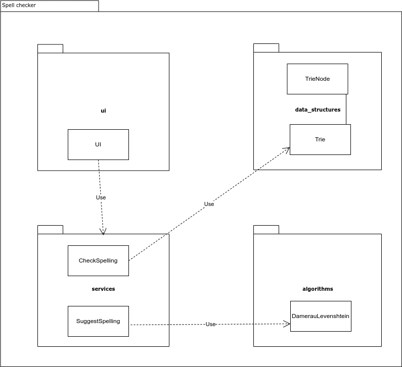
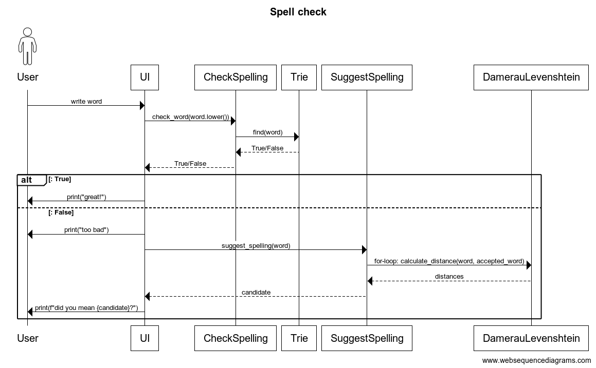

# Implementation

## Architecture

The application has the following packages:

- The package _ui_ is responsible for the user interface.
- The package _services_ is responsible for the logic of the application.
    - CheckSpelling checks if the input from the user is correctly
      spelled or not
    - SuggestSpelling suggests correctly spelled words for the
      misspelled ones
- The package _data_structures_ contains the data structures that were coded for
  this project
    - TrieNode represents one node in the trie structure
    - Trie represents a trie data structure
- The package _algorithms_ contains the algorithms needed for the project
    - DamerauLevenshtein is an algorithm that calculates the Damerau-Levenshtein distance between two strings

## Process interactions

After startup and initialization, the UI of the application asks the user to write a word
for a spell check.

The UI will pass the word onto the 'CheckSpelling' service. The service will
use a trie data structure consisting of 350 000 correctly spelled words to check if the original
word is among them.

If the word is spelled in an acceptable way, the user gets a quick feedback
(the text "great", at the moment).

If the word seems to be misspelled, the UI will then call the 'SuggestSpelling'
service. This service will use a list of 40 000 correctly spelled words that is sorted by their frequency. It will calculate the Damerau-Levenshtein(DL) distance between the original word and the words on the list. It returns a candidate from the list with as small DL distance as possible.

Finally, the UI will suggest this candidate to the user.
