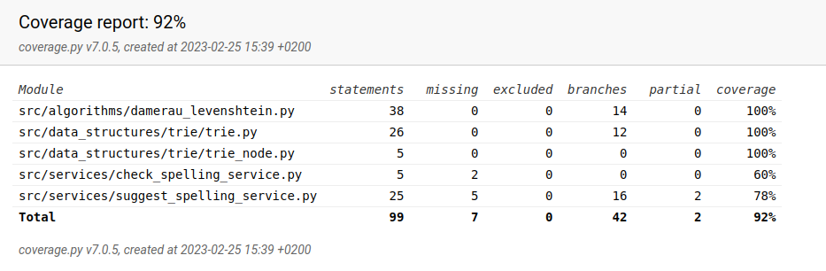

# Test documentation

## Unit tests

There are automated unit tests testing the modules.

### Testing the Damerau-Levenshtein algorithm

[The unit tests](../src/tests/algorithms/damerau_levenshtein_test.py) for the Damerau-Levenshtein algorithm test the different types of distance between words: addition, deletion, substitution and transposition. Multiple variations of a string with their corresponding distances are also tested.

### Testing the trie data structure

[The unit tests](../src/tests/data_structures/trie/trie_test.py) for the trie data
structure test test the functions of the trie structure. There is:
- a test that checks that the trie is empty after initialization,
- a test that checks that adding words into the trie works as expected and
- a test to check that the trie reads a file correctly.

### Testing the services

The services have simple tests to assure they work as expected.
- [The test for CheckSpelling
  service](../src/tests/services/check_spelling_service_test.py) uses a [mock
trie structure](../src/tests/services/mock_trie.py) to test that the service
uses parameters correctly and returns values as expected.
- [The test for SuggestSpelling
  service](../src/tests/services/suggest_spelling_service_test.py) uses a [mock
DamerauLevenshtein
algorithm](../src/tests/services/mock_damerau_levenshtein.py) to test that the
service returns the expected suggestion.

### Unit test coverage

Unit test coverage is 92 % as of Feb 25th.

