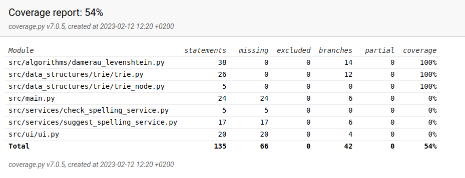

# Test documentation

## Unit tests

There are automated unit tests testing the modules.

### Testing the Damerau-Levenshtein algorithm

[The unit tests](../src/tests/algorithms/damerau_levenshtein_test.py) for the Damerau-Levenshtein algorithm test the different types of distance between words: addition, deletion, substitution and transposition. These tests still need some attention as they may not be sufficient as they are.

### Testing the trie data structure

[The unit tests](../src/tests/data_structures/trie/trie.py) for the trie data
structure test test the functions of the trie structure. There is:
- a test that checks that the trie is empty after initialization,
- a test that checks that adding words into the trie works as expected and
- a test to check that the trie reads a file correctly.

### Unit test coverage

Unit test coverage is 54 % as of Feb 12th, going down from 100%.

