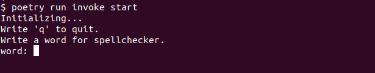
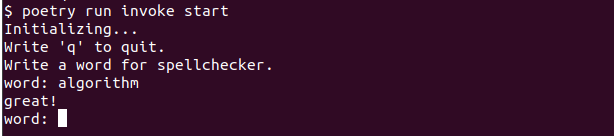
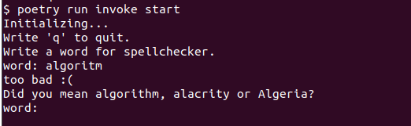

# User guide

## Installation

To use the application, one needs to have Python 3 and [Poetry](https://python-poetry.org/) installed. The
application has been developed and tested using Python 3.10.6. It may not
work as inteded if used with an older version of Python.

### Installation step-by-step

1. Clone the project.

2. Install the dependencies:
```
poetry install
```

3. Start the application:
```
poetry run invoke start
```

## Using the application

After startup the application will initialize the data structures. This may
take a couple of seconds.

After initialization the application asks the user to write a word for the
spell checker. Typing "q" will kill the application.



The spell checker checks one word at a time. The user gets a quick feedback on
whether the word was spelled correctly or not.

Strings consisting of letters from the English alphabet are accepted. Strings
containing numbers or special characters are likely to be considered
misspelled.



If the word seemed to be misspelled, the spell checker will suggest three
correctly spelled words.



## Other command line commands

### Running the tests
```
poetry run invoke test
```

### Creating a test coverage report
```
poetry run invoke coverage-report
```

### Running a pylint check
```
poetry run invoke pylint
```

